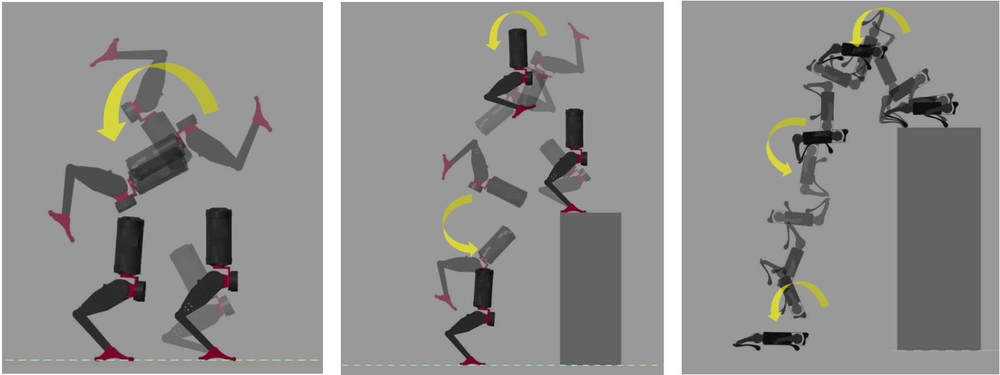

## VI_discretized_TO

This work is presented at ICRA 2025.

Paper: https://erl.ucsd.edu/ref/BeckNguyen_VITO_ICRA25.pdf

Video: https://www.youtube.com/watch?v=z4HzWtGu9RM

## How to cite
```
@inproceedings{VI_discretized_TO,
  title={High Accuracy Aerial Maneuvers on Legged Robots using Variational Integrator Discretized Trajectory Optimization},
  author={Scott Beck, Chuong Nguyen, Thai Duong, Nikolay Atanasov, Quan Nguyen},
  booktitle={IEEE International Conference on Robotics and Automation (ICRA)},
  year={2025}
}
```

This repository contains the code for Trajectory Optimization using Variational Integration
to achieve high accuracy aerial maneuvers on legged robots. 
Examples on other dynamical systems
are also provided.


<p float="left">

</p>

### Matlab Toolbox 
- Symbolic Math Toolbox
- Simscapte Multibody
- Simulink

### Code structure
- Each example includes
  
   (1) main.m file to run TO

   (2) getStruct.m to get the tree structure of the robot/ system
 
   (3) animate.m to simulate the optimal solution
- In getStruct.m
    - nx is the number of generalized coordinates present in this model
    - robotStruct contains a series of nodes of 3 types
      - "Joint" type nodes are revolute or prismatic joints that connect nodes
      - "Mass" type nodes are rigidly connected to joints and contain inertial data
      - "Contact" type nodes are massless and rigidly connected to joints and are the defined contact points with the terrain
- Simulink Models consists various simulated dynamical system by Simscape

### Note
- Set path: add with subfolder to SimilinkModels to initialize system parameters and functions
